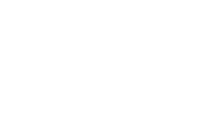
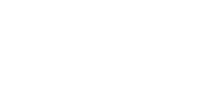
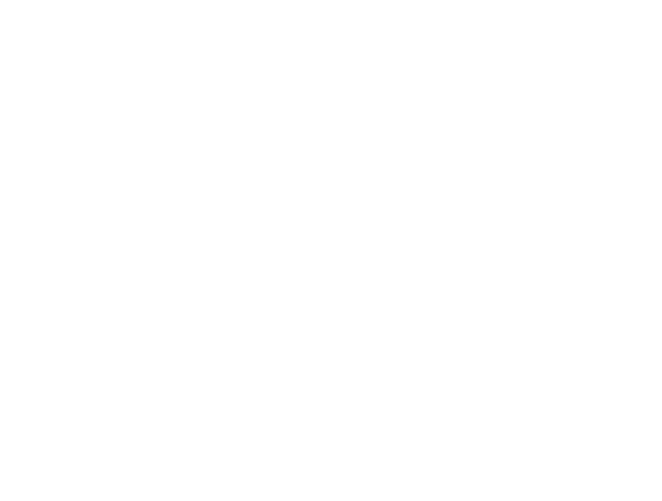

<!-- ============================================================
     MININDU PASAN — github.com/minindupasan
     ============================================================ -->

  

&nbsp;

&nbsp;

 

> Computer Systems Engineering student building the layer between silicon and software — embedded firmware, ROS 2 robot stacks, and the PCBs underneath. Currently an Associate Embedded Systems Engineer at **Vega Innovations**, taking hardware from schematic to deployed firmware.

 

---

## Skills

<table>
  <tr>
    <td><b>Robotics</b></td>
    <td>ROS 2 &nbsp;·&nbsp; URDF/Xacro &nbsp;·&nbsp; Nav2 &nbsp;·&nbsp; SLAM Toolbox &nbsp;·&nbsp; PID control</td>
  </tr>
  <tr>
    <td><b>Firmware</b></td>
    <td>C &nbsp;·&nbsp; C++ &nbsp;·&nbsp; bare-metal &nbsp;·&nbsp; real-time &nbsp;·&nbsp; HAL design</td>
  </tr>
  <tr>
    <td><b>MCU / SoC</b></td>
    <td>STM32 &nbsp;·&nbsp; ESP32 &nbsp;·&nbsp; ESP8266 &nbsp;·&nbsp; AVR &nbsp;·&nbsp; Jetson Orin &nbsp;·&nbsp; Raspberry Pi</td>
  </tr>
  <tr>
    <td><b>Hardware</b></td>
    <td>KiCad &nbsp;·&nbsp; Altium &nbsp;·&nbsp; schematic capture &nbsp;·&nbsp; PCB layout &nbsp;·&nbsp; bring-up</td>
  </tr>
  <tr>
    <td><b>Protocols</b></td>
    <td>I2C &nbsp;·&nbsp; SPI &nbsp;·&nbsp; UART &nbsp;·&nbsp; CAN &nbsp;·&nbsp; MQTT &nbsp;·&nbsp; LoRa &nbsp;·&nbsp; Zigbee</td>
  </tr>
  <tr>
    <td><b>Vision / AI</b></td>
    <td>object detection &nbsp;·&nbsp; depth estimation &nbsp;·&nbsp; edge ML (learning)</td>
  </tr>
</table>

 

## Software Stack

&nbsp;

&nbsp;

&nbsp;

&nbsp;

&nbsp;

&nbsp;

&nbsp;

&nbsp;

&nbsp;

## Ventures

<table>
  <tr>
    <td align="center" width="25%">
      
        
      <b>Casper.robotics</b> 
      Robotics platforms and kits for builders.
    </td>
    <td align="center" width="25%">
      
        
      <b>Casper.learn</b> 
      Hands-on robotics education and curriculum.
    </td>
    <td align="center" width="25%">
      
        
      <b>Laampu.lk</b> 
      Connected lighting for Sri Lankan homes.
    </td>
    <td align="center" width="25%">
      
        
      <b>Extrude3d.live</b> 
      On-demand 3D printing and fabrication.
    </td>
  </tr>
</table>

 

## Education

- **BSc (Hons) Computer Systems Engineering** — SLIIT, Malabe &nbsp;·&nbsp; GPA 3.17 / 4.0 &nbsp;·&nbsp; expected May 2027
- **BSc (External) Electronics & Automation Technologies** — University of Colombo &nbsp;·&nbsp; GPA 3.83 / 4.0 &nbsp;·&nbsp; expected Feb 2027

 

## Stats

&nbsp;

 

S/N &nbsp;&nbsp; 73 75 64 6F 20 68 69 72 65 20 6D 65

